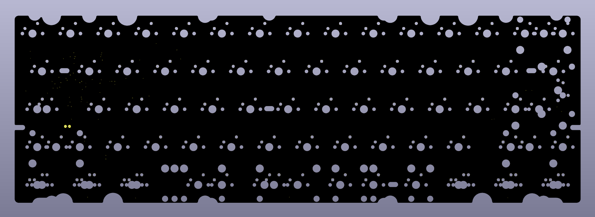
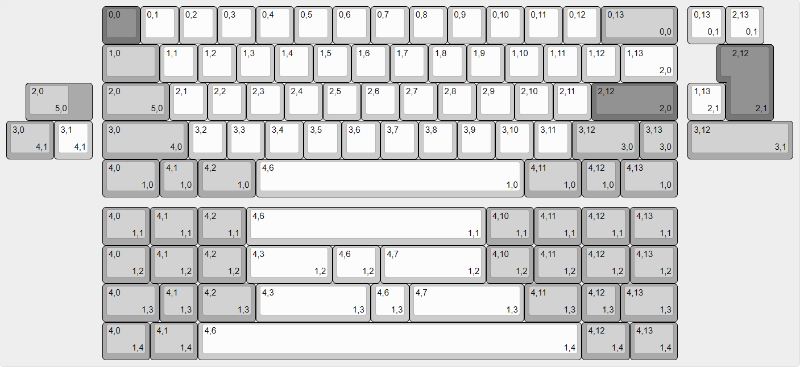
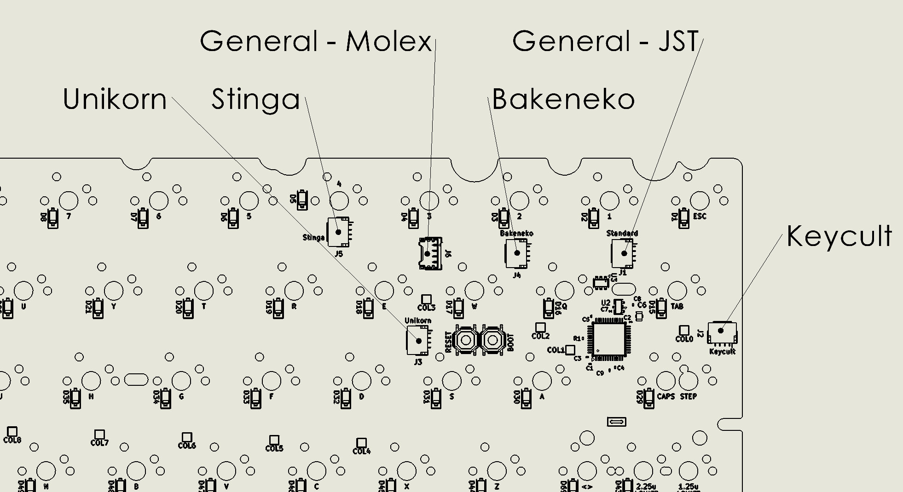

# Universal PCBs

**Open-source, QMK/VIA-compatible keyboard PCBs designed to fit as many cases as possible.**



Most custom keyboard cases are designed around one specific PCB. The boards in this repo work the other way around. Each one is built to drop into as many cases of its form factor as possible, by supporting a wide range of layouts and matching the connector and mounting positions that different cases expect.

---

## Boards

| Board | Form factor | Type | Status | Firmware |
|---|---|---|---|---|
| [**Uni60 Solder**](Uni60/UNI60_Solder) | 60% | Solder | ✅ Complete. 50-unit production run, Sep 2026 | [Uni60/Solder](https://github.com/ShentoBento/Universal_PCBs_Firmware/tree/main/Uni60/Solder) |
| [**Uni60 Hotswap**](Uni60/UNI60_Hotswap) | 60% | Hotswap | 🚧 In development | — |

Each board's folder has its own README with full specs, layout diagrams and ordering files.

---

## What "universal" means here

**Layouts.** Each board supports the common layout variations for its size. The Uni60 covers ANSI and ISO, split backspace, split left and right shift, stepped caps, and five bottom rows: 6.25u, 7u, 10u, 2.25u/1.25u/2.75u split, and 3u/1u/3u split.



**Connectors.** Enthusiast cases route the USB daughterboard cable through a channel, and that channel sits in a different place in nearly every case. A tall JST-SH connector anywhere else bottoms out on the case floor. So the Uni60 has **five daisy-chained JST-SH positions** that line up with common channel locations. Keep the one your case uses and clip or desolder the rest. There's also a **Molex Pico-EZmate** connector, which sits lower than the switch pins and fits any case.



**Outline and mounting.** The board outline is drawn to suit as many cases as possible. It includes tray-mount holes between keys, with the switch matrix routed around them.

---

## Shared specs

- **MCU:** STM32F072CBTx
- **Connectors:** JST-SH 4-pin (multiple positions) and Molex Pico-EZmate 4-pin
- **Firmware:** QMK with VIA and Vial support, in [Universal_PCBs_Firmware](https://github.com/ShentoBento/Universal_PCBs_Firmware)
- **Design tool:** KiCad 10 or newer (earlier versions won't open the files)
- **Manufacturing:** fab and assembly files generated for JLCPCB

---

## Repository layout

```
Universal_PCBs/
├── Uni60/
│   ├── UNI60_Solder/              complete: KiCad project, production files, images
│   └── UNI60_Hotswap/             in development
└── shentobento_kicad_library/     shared symbols, footprints and 3D models
```

## Using these files

1. Clone or download the **whole repo**, not just one board's folder. Every board points at the shared `shentobento_kicad_library/` with relative paths, so the projects open on any machine with no library setup.
2. Open the board's `.kicad_pro` file in KiCad 10 or newer.
3. To order boards, use the files in that board's `production/` folder (gerbers, BOM, positions). If you change the design, regenerate them with the JLCPCB Fabrication Toolkit plugin.

## Related

- [Universal_PCBs_Firmware](https://github.com/ShentoBento/Universal_PCBs_Firmware): QMK firmware for these boards
- [Velvet-Pro-Solder-PCB](https://github.com/ShentoBento/Velvet-Pro-Solder-PCB): the board whose matrix and MCU design the Uni60 builds on

## Credits and licenses

Keyboard footprints and symbols are derived from [marbastlib](https://github.com/ebastler/marbastlib) by ebastler, licensed under CERN-OHL-P v2. See `shentobento_kicad_library/LICENSE-marbastlib.txt`; modifications are logged in `shentobento_kicad_library/NOTICE.md`. Generic footprints come from the KiCad standard libraries.

---

Designed by **Andrew Shentu** ([@ShentoBento](https://github.com/ShentoBento)) · [LinkedIn](https://www.linkedin.com/in/andrewshentu)
